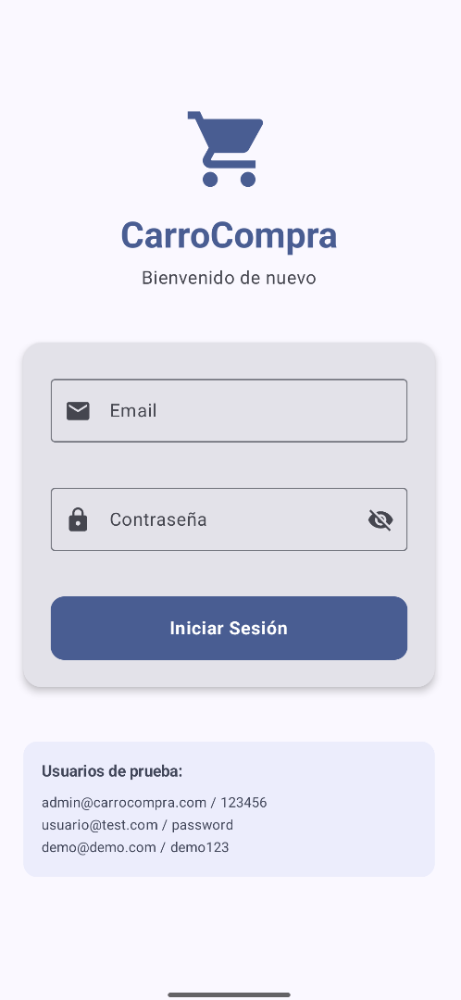

# Setup: Proyecto Android con Kotlin, Jetpack Compose y Material3

**Basado en documentación oficial:**
- [Android Developers - Jetpack Compose](https://developer.android.com/develop/ui/compose)
- [Material Design 3](https://m3.material.io/develop/android/jetpack-compose)
- [Architecture Components - ViewModel](https://developer.android.com/topic/libraries/architecture/viewmodel)

---

## Introducción

### ¿Qué es Material3?

**Material3** es el sistema de diseño de Google con componentes modernos, temas dinámicos y mejor accesibilidad.

### ¿Qué es MVVM?

**MVVM** (Model-View-ViewModel) es un patrón arquitectónico que separa la lógica de negocio de la interfaz de usuario.


| Capa | Responsabilidad |
|------|-----------------|
| **Model** | Datos y lógica de negocio |
| **ViewModel** | Estado y lógica de presentación |
| **View** | Interfaz de usuario (Compose) |

**Flujo de datos:**
```
View → ViewModel → Model
  ↑         ↓
  ←─────────┘
(Estado actualizado)
```

---

## ¿Qué vamos a construir?

En esta serie de documentos crearemos una **aplicación de Login moderna** para Android usando:

- **Kotlin** como lenguaje de programación
- **Jetpack Compose** para la interfaz de usuario
- **Material3** para el diseño moderno
- **Arquitectura MVVM** para separar responsabilidades

### Características de la app:

- **Pantalla de Login funcional** con validaciones en tiempo real
- **Campos de email y contraseña** con validación de formato
- **Mostrar/ocultar contraseña** con icono interactivo
- **Estados visuales**: loading, error, éxito
- **Mensajes de error** descriptivos y claros
- **Usuarios de prueba** incluidos para testing
- **Diseño responsivo** que se adapta a diferentes pantallas

### Resultado final:

Al completar los 4 documentos, tendrás una app como esta:



La app incluye validaciones, estados de carga, manejo de errores y una UI profesional con Material3.

---

## Setup Paso a Paso

### Paso 1: Crear proyecto en Android Studio

**En Windows:**

1. Abrir **Android Studio**
2. Click en **"New Project"**
3. Seleccionar **"Empty Activity"** (con Compose)


4. Configurar:
   - **Name:** CarroCompra
   - **Package name:** duoc.desarrollomobile.carrocompra
   - **Save location:** `C:\Users\user\Desktop\CarroCompra`
   - **Language:** Kotlin
   - **Minimum SDK:** API 30 (Android 11)
   - **Build configuration language:** Kotlin DSL (build.gradle.kts)
5. Click en **"Finish"**

Android Studio creará el proyecto y descargará las dependencias necesarias (puede tardar unos minutos).

---

### Paso 2: Verificar configuración inicial

#### A) Verificar build.gradle.kts (Module: app)

Abre el archivo `app/build.gradle.kts` y verifica que tenga estas configuraciones:

```kotlin
plugins {
    alias(libs.plugins.android.application)
    alias(libs.plugins.kotlin.android)
    alias(libs.plugins.kotlin.compose)
}

android {
    namespace = "duoc.desarrollomobile.carrocompra"
    compileSdk = 36

    defaultConfig {
        applicationId = "duoc.desarrollomobile.carrocompra"
        minSdk = 30
        targetSdk = 36
        versionCode = 1
        versionName = "1.0"
    }

    buildFeatures {
        compose = true
    }

    kotlinOptions {
        jvmTarget = "11"
    }
}

dependencies {
    implementation(libs.androidx.core.ktx)
    implementation(libs.androidx.lifecycle.runtime.ktx)
    implementation(libs.androidx.activity.compose)
    implementation(platform(libs.androidx.compose.bom))
    implementation(libs.androidx.ui)
    implementation(libs.androidx.ui.graphics)
    implementation(libs.androidx.ui.tooling.preview)
    implementation(libs.androidx.material3)
}
```

---

### Paso 3: Agregar dependencias de ViewModel

Necesitamos agregar las dependencias de ViewModel para implementar la arquitectura MVVM.

#### Editar app/build.gradle.kts

Abre `app/build.gradle.kts` y **agrega** estas líneas en la sección `dependencies`:

```kotlin
dependencies {
    // ... dependencias existentes ...

    // ViewModel para Compose
    implementation("androidx.lifecycle:lifecycle-viewmodel-compose:2.9.4")
    implementation("androidx.lifecycle:lifecycle-runtime-compose:2.9.4")

    // Material Icons Extended (para iconos de email, lock, etc.)
    implementation("androidx.compose.material:material-icons-extended:1.7.7")
}
```

**¿Para qué sirve cada dependencia?**

| Dependencia | Propósito |
|-------------|-----------|
| `lifecycle-viewmodel-compose` | Integración de ViewModel con Compose |
| `lifecycle-runtime-compose` | Ciclo de vida para Compose |
| `material-icons-extended` | Iconos adicionales de Material Design |

**Referencias de la documentación oficial:**
- [Lifecycle Release Notes](https://developer.android.com/jetpack/androidx/releases/lifecycle) - Versiones de lifecycle-viewmodel-compose y lifecycle-runtime-compose
- [Compose Material Release Notes](https://developer.android.com/jetpack/androidx/releases/compose-material) - Versiones de material-icons-extended
- [ViewModel and State in Compose Codelab](https://developer.android.com/codelabs/basic-android-kotlin-compose-viewmodel-and-state) - Guía oficial de uso de ViewModel con Compose

---

### Paso 4: Sincronizar proyecto con Gradle

**En Android Studio:**

1. Después de modificar `build.gradle.kts`, aparecerá un banner amarillo arriba
2. Click en **"Sync Now"**
3. O ve a `File` → `Sync Project with Gradle Files`
4. Espera a que termine la sincronización, verás la barra de progreso abajo

**Salida esperada en Build:**
```
BUILD SUCCESSFUL in 15s
```

---

### Paso 5: Crear estructura de carpetas (Arquitectura MVVM)

Ahora crearemos la estructura de paquetes para organizar el código según MVVM

**En Android Studio:**

1. Ve al panel izquierdo (Project)
2. Navega a `app/src/main/java/duoc/desarrollomobile/carrocompra/`
3. Click derecho en `carrocompra` → `New` → `Package`

Crea estos **4 paquetes** uno por uno:

```
carrocompra/
├── model        (Modelos de datos y repositorios)
├── viewmodel    (ViewModels con lógica de presentación)
├── view         (Pantallas con Jetpack Compose)
└── utils        (Utilidades y validaciones)
```

**Resultado final:**

```
app/src/main/java/duoc/desarrollomobile/carrocompra/
├── model/
├── view/
├── viewmodel/
├── utils/
├── ui/theme/
└── MainActivity.kt
```

---

### Paso 6: Verificar que el proyecto funciona

Antes de empezar a programar, asegúrate de que el proyecto base funciona correctamente

---

## Estructura del Proyecto (Antes de programar)

```
CarroCompra/
├── app/
│   ├── src/
│   │   ├── main/
│   │   │   ├── java/duoc/desarrollomobile/carrocompra/
│   │   │   │   ├── model/
│   │   │   │   ├── viewmodel/
│   │   │   │   ├── view/
│   │   │   │   ├── utils/
│   │   │   │   ├── ui/theme/
│   │   │   │   └── MainActivity.kt
│   │   │   └── AndroidManifest.xml
│   │   └── res/
│   └── build.gradle.kts
├── gradle/
├── build.gradle.kts
└── settings.gradle.kts
```

---

## Código Final: build.gradle.kts

```kotlin
plugins {
    alias(libs.plugins.android.application)
    alias(libs.plugins.kotlin.android)
    alias(libs.plugins.kotlin.compose)
}

android {
    namespace = "duoc.desarrollomobile.carrocompra"
    compileSdk = 36

    defaultConfig {
        applicationId = "duoc.desarrollomobile.carrocompra"
        minSdk = 30
        targetSdk = 36
        versionCode = 1
        versionName = "1.0"

        testInstrumentationRunner = "androidx.test.runner.AndroidJUnitRunner"
    }

    buildTypes {
        release {
            isMinifyEnabled = false
            proguardFiles(
                getDefaultProguardFile("proguard-android-optimize.txt"),
                "proguard-rules.pro"
            )
        }
    }
    compileOptions {
        sourceCompatibility = JavaVersion.VERSION_11
        targetCompatibility = JavaVersion.VERSION_11
    }
    kotlinOptions {
        jvmTarget = "11"
    }
    buildFeatures {
        compose = true
    }
}

dependencies {

    implementation(libs.androidx.core.ktx)
    implementation(libs.androidx.lifecycle.runtime.ktx)
    implementation(libs.androidx.activity.compose)
    implementation(platform(libs.androidx.compose.bom))
    implementation(libs.androidx.ui)
    implementation(libs.androidx.ui.graphics)
    implementation(libs.androidx.ui.tooling.preview)
    implementation(libs.androidx.material3)

    implementation("androidx.lifecycle:lifecycle-viewmodel-compose:2.9.4")
    implementation("androidx.lifecycle:lifecycle-runtime-compose:2.9.4")
    implementation("androidx.compose.material:material-icons-extended:1.7.7")

    testImplementation(libs.junit)
    androidTestImplementation(libs.androidx.junit)
    androidTestImplementation(libs.androidx.espresso.core)
    androidTestImplementation(platform(libs.androidx.compose.bom))
    androidTestImplementation(libs.androidx.ui.test.junit4)
    debugImplementation(libs.androidx.ui.tooling)
    debugImplementation(libs.androidx.ui.test.manifest)
}
```

---
